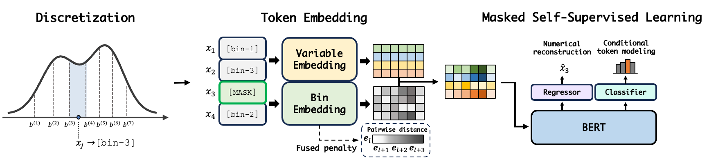

# [ICML 2026] TabularBERT: Binning-Based Self-Supervised Learning for Tabular Representation

This repository provides the official implementation of **TabularBERT**, a Transformer-based model for tabular data that tokenizes continuous variables via binning and learns numerically structured representations through MLM pretraining and downstream fine-tuning.

<p align="center">

</p>

## Installation

- Requirements: See `requirements.txt`

#### Method 1: Install from Source (Recommended)

1. Download the package source from GitHub:
   ```bash
   git clone https://github.com/bbeomjin/tabularbert.git
   ```

2. Navigate to the package directory:
   ```bash
   cd tabularbert
   ```

3. Install the package locally:
   ```bash
   pip install .
   ```

#### Method 2: Install from ZIP Archive

1. Download the ZIP file from GitHub:
   - Click "`Code`" & "`Download ZIP`"

2. Unzip the package file and navigate to the package directory:
   ```bash
   cd tabularbert-main
   ```

3. Install from files locally:
   ```bash
   pip install -e .
   ```

## Quick Start

Here's a basic example of how to use TabularBERT:

```python
import pandas as pd
import torch
from sklearn.model_selection import train_test_split
from sklearn.preprocessing import QuantileTransformer
from tabularbert import TabularBERTTrainer

# Load your tabular data
data = pd.read_csv("your_dataset.csv")
X = data.iloc[:, :-1].values
y = data.iloc[:, -1].values

# Split and preprocess data
train_X, test_X, train_y, test_y = train_test_split(X, y, train_size=0.8, random_state=0)

# Scale features
scaler = QuantileTransformer(n_quantiles=10000, output_distribution='uniform')
train_X_scaled = scaler.fit_transform(train_X)

# Initialize TabularBERT trainer
trainer = TabularBERTTrainer(
    x=train_X_scaled,
    num_bins=50,
    device=torch.device('cuda' if torch.cuda.is_available() else 'cpu')
)

# Setup directories and logging
trainer.setup_directories_and_logging(
    save_dir='./pretraining',
    phase='pretraining',
    project_name='My TabularBERT Project'
)

# Start pretraining
trainer.pretrain()
```

- For more detailed documentation and advanced usage examples, please refer to: `example.py`

## Citation

If you use TabularBERT in your research, please cite:

```bibtex
@inproceedings{park2026tabularbert,
    title={TabularBERT: Binning-Based Self-Supervised Learning for Tabular Representation},
    author={Beomjin Park and Seunghwan An and Sungchul Hong and Hosik Choi},
    booktitle={Forty-third International Conference on Machine Learning},
    year={2026}
}
```

## License

This project is licensed under the MIT License - see the LICENSE file for details.
